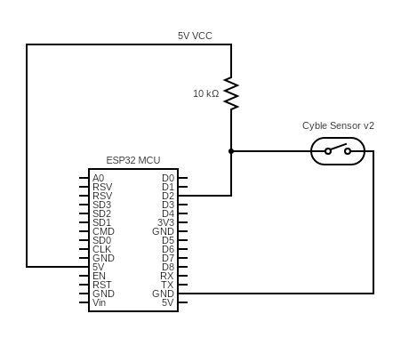
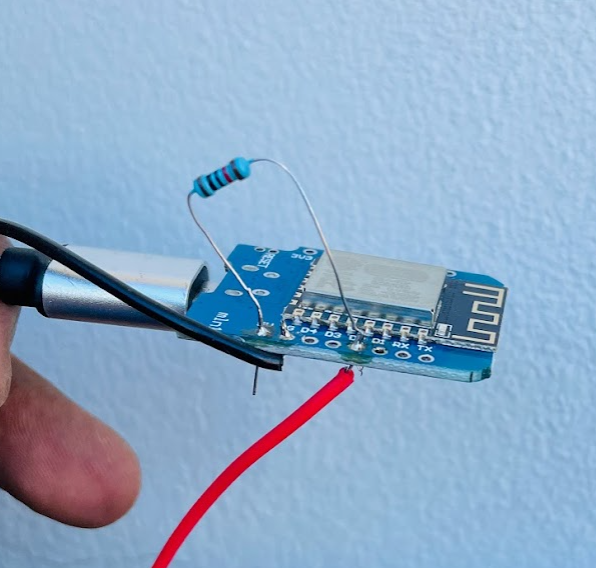
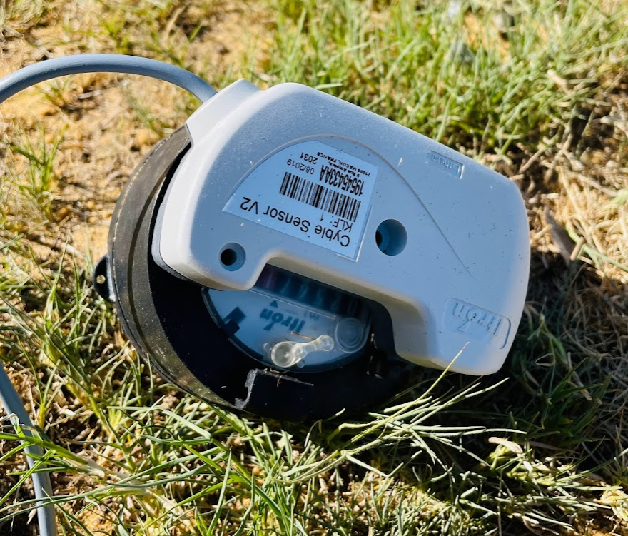
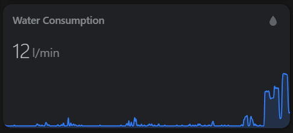

# ESPHome Water Meter Sensor for Home assistant

# Introduction
Yesterday, I used a Cyble Sensor v2 to measure my house water usage over time. The project was a success. It's a very simple setup with a small custom circuit. I bought the Cyble Sensor  for around `AU$70` online. Then connected it to a D1 mini with a pull up resistor. Programmed the D1 mini using the code in this repo. 

# Prerequisites
- Home Assistant Setup
- ESP Home setup 
- Cyble Sensor v2
- D1 Mini (ESP32 MCU)

# Circuil Diagram and Photos









# Home Assistant configuration

In Home Assistant you will need to have a counter and utility meter as below. 

```yaml
counter:
  water_meter_count:
    initial: 0
    step: 1
    icon: mdi:cup-water
```

```yaml
utility_meter:
  water_meter_daily:
    source: sensor.water_usage_liters
    cycle: daily

  water_meter_monthly:
    source: sensor.water_usage_liters
    cycle: monthly
```

```yaml
sensor:
  - platform: template
    sensors:
      water_usage_liters:
        unit_of_measurement: 'l'
        friendly_name: 'Water Usage Liters'
        value_template: "{{ states('counter.water_meter_count') | int }}"
```